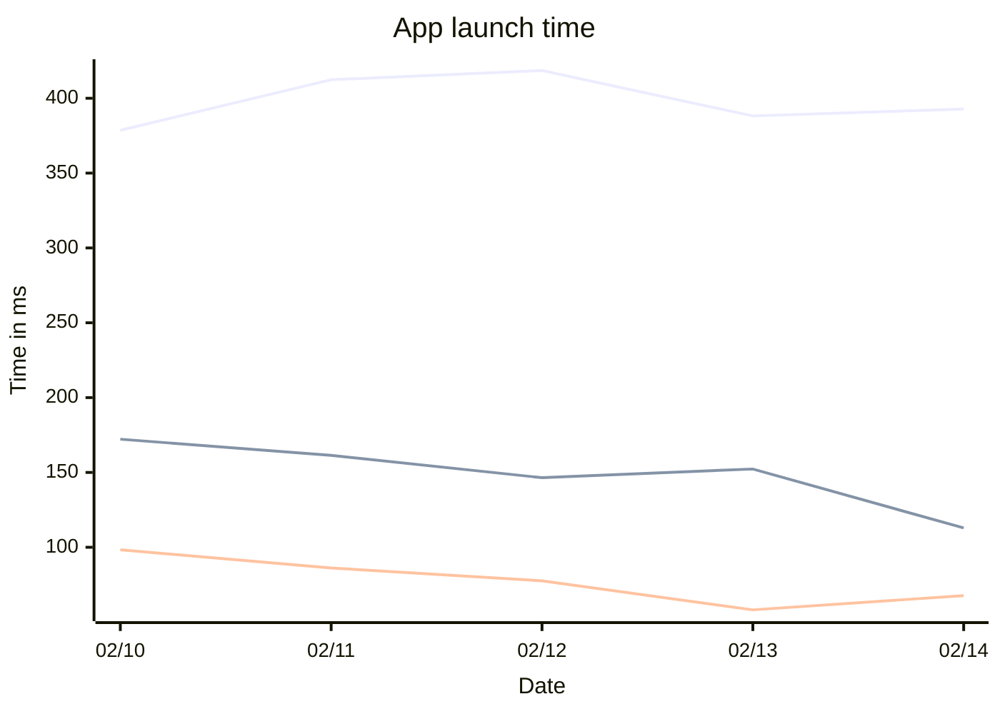

\
\
\
\

```mermaid
xychart-beta
title "App launch time"
x-axis "Date" ["02/10", "02/11", "02/12", "02/13", "02/14"]
y-axis "Time in ms"
line [378.6, 412.4, 418.5, 388.2, 392.8]
line [172.2, 161.4, 146.5, 152.3, 112.9]
line [98.3, 86.2, 77.6, 58.2, 67.7]
```
